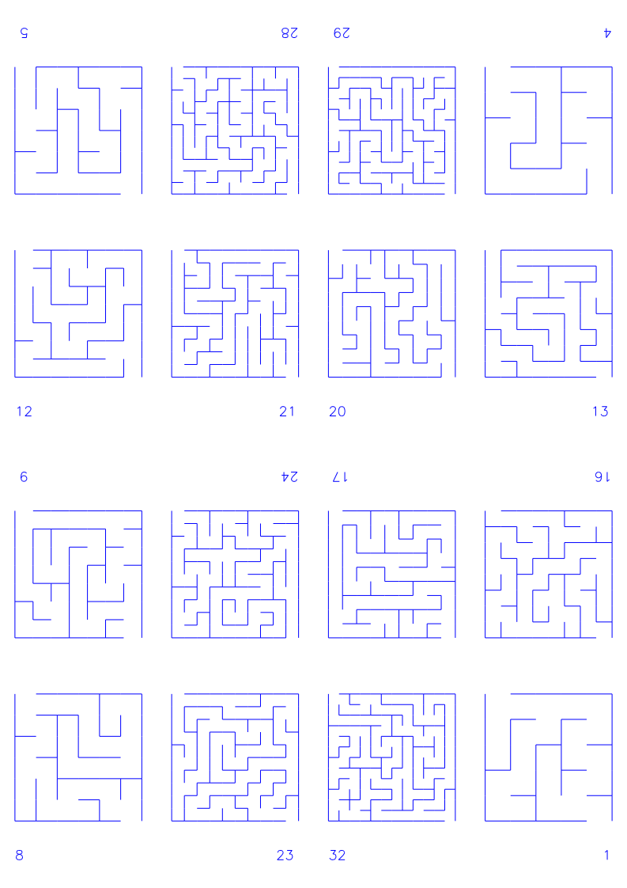
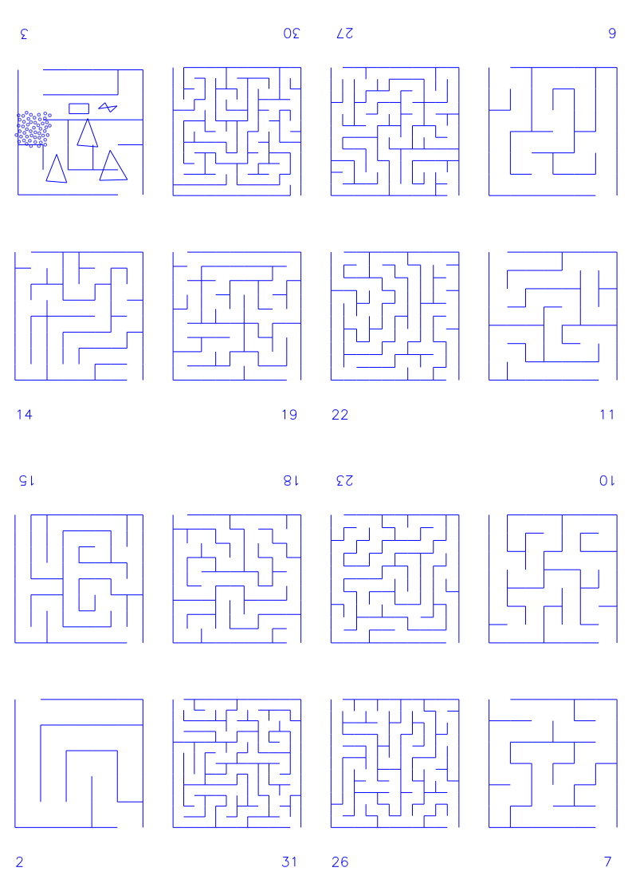

# creatative_code

a collection of creative code attempts. Main focus is to generate outputs to plot.

the creative part is to generate svg's

than it goes to a pipeline vpype and bCNC

# gallery

## mazes

### depth first 

## vpype

### booklet

